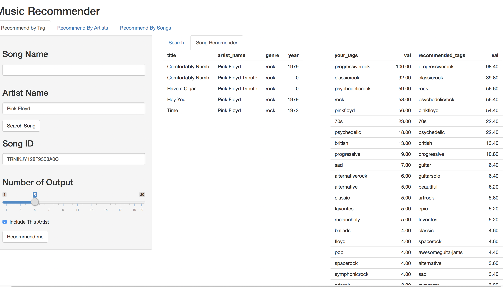
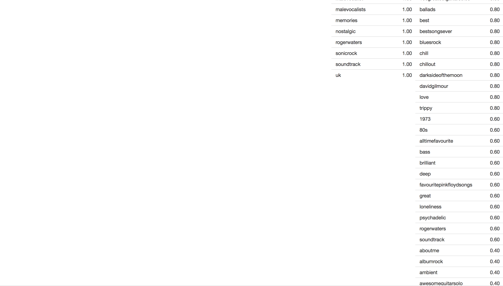
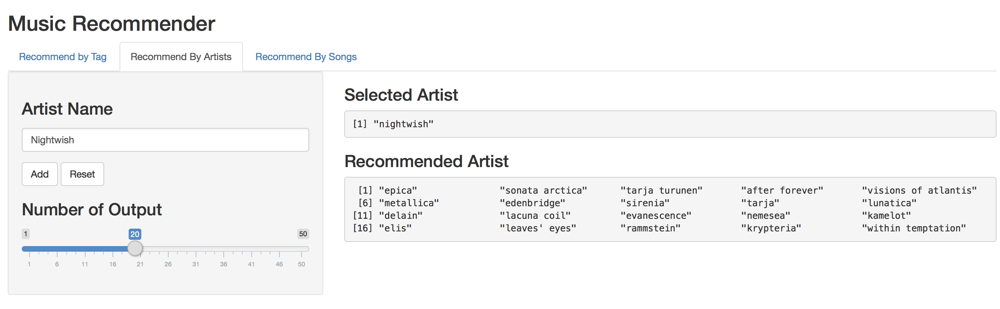
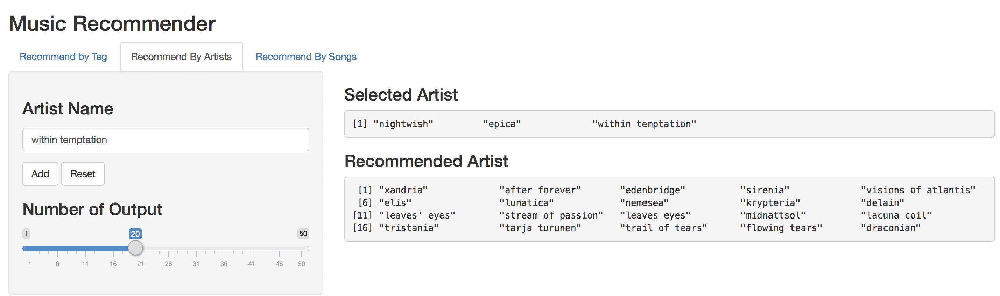
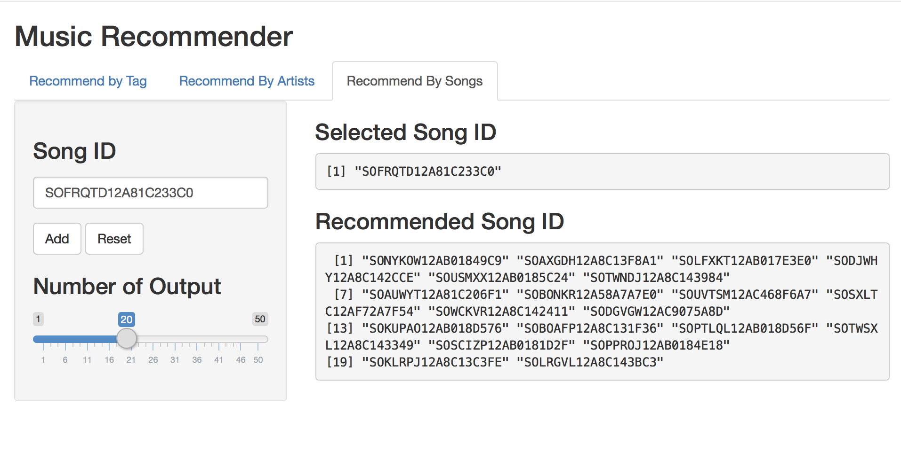

---
title: "گزارش فاز سوم پروژه تحلیل داده موسیقی"
author: "نگار مخبریان - مهدی بهروزی خواه"
output: html_document
---
<html dir="rtl"><meta charset="UTF-8" />
<font face="XB Niloofar">
```{r setup, include=FALSE}
knitr::opts_chunk$set(echo = TRUE)
```

## مقدمه
همانطور که در فاز قبلی شرح داده شد، هدف این پروژه کار با داده های موسیقی حجیم و آنالیز این داده‌ها بود. در این فاز قبلی اکثر تلاش ما سر جمع آوری و تمیز سازی داده بود که همانطور که توضیح دادیم، توانستیم داده‌های بسیار خوبی جمع آوری کنیم و تمیز کنیم و در پایگاه های داده‌اما ن قرار دهیم. چند آنالیز کلی از داده گرفتیم و سعی کردیم آمار های اولیه‌ای از داده ارائه دهیم.

در این فاز سعی کردیم به تحلیل بپردازیم و از داده‌ها استفاده کنیم. کاری که کردیم رویکرد پیشنهاد دادن آهنگ و خواننده بود و به طور کلی به چند روش مختلف recommendation system هایی را پیاده سازی کردیم که در عمل واقعا جواب‌های خوبی گرفتیم.


## رابط کاربری

با استفاده از کتابخانه shiny توانستیم این قابلیت ها را interactive کنیم و به صورت یک سایت جدی، این خدمات را ارائه دهیم. متاسفانه به دلیل اینکه گزارش به صورت آفلاین است و حجم داده‌های ما هم بالا بود، نتوانستیم این قابلیت را به شما نمایش دهیم، اما امیدواریم اسکرین شات‌های گرفته شده کافی باشند و بتوانند بخشی از قابلیت‌ها و کارهای انجام شده را نشان دهند. 

همچنین این پروژه را در گیت‌هاب قرار دادیم تا سایر فعالین این عرصه نیز بتوانند از آن استفاده کنند.


## جست‌و‌جو در داده‌ها

اولین کاری که انجام دادیم، رابطی برای جست‌جوی آهنگ‌ها در داده‌ها بود، از آنجایی که همه داده‌ها را به صورت sqllite نگهداری کردیم، این قابلیت را دادیم تا افراد بر حسب نام آهنگ و یا نام خواننده، بتوانند آهنگ‌ها را پیدا کنند. 

نکته ای که هست این است که ما در این بخش دوتا ID به کاربر برای هر آهنگ میدهیم. این id ها به طور کلی فلسفه جالبی دارند. مثلا ممکن است برای یک آهنگ با یک نام، چند آهنگ هم‌نام با این آهنگ نیز وجود داشته باشند، در نتیجه باید تمایزی بین این‌ها قرار داد، همچنین ممکن است حتی یک آهنگ یک خواننده، چند بار خوانده شده باشد. اما نکته اینجاست که ما در واقع دو نوع id داریم که یکی به ازای نسخه‌های مختلف یک آهنگ، یکتاست و دیگری متفاوت و این در واقع به دلیل استفاده ما از musicbrainz id و داده‌های خوب 1 million songs است.


<div align="center">

</div>


## پیشنهاد آهنگ بر حسب آهنگ بر اساس تگ

در این قسمت کار جالبی کردیم، داده‌ای که از چند سایت مختلف جمع آوری شده بود را گرفتیم، در این داده برای هر آهنگ، چندین تگ(برای بعضی آهنگ‌ها تا ۵۰ تگ) داشتیم که به نوعی توصیفی از این آهنگ بود. فرض ما این بود که اگر این تگ‌ها داده خوبی را همراه داشته باشند، میتوانند ما را برای پیدا کردن آهنگ‌های مشابه یاری کنند. از طرفی چون بعضی تگ‌ها واقعا شبیه هم بودند، اما اسم‌های متفاوتی داشتند، باید به نوعی این موارد را نیز لحاظ می‌کردیم. ازین رو از ایده‌های mir و pca بهره گرفتیم.

اصول کار به این صورت بود که یک ماتریس sparse از آهنگ‌ها و تگ‌ها ساختیم. حال چون تعداد تگ‌ها زیاد بود و مشکلی که گفت را داشتیم،‌این ماتریس را به یک ماتریس با ۱۵۰ تا ستون بردیم و در واقع به نوعی تگ‌ها را در این ۱۵۰ تا ستون خلاصه کردیم. در نتیجه به ما این امکان را مید‌هد که مثلا اگر metal و rock در آهنگ‌های زیادی باهم آمده اند، روی هم تاثیر بیشتری بگذارند. در نتیجه هم حجم محاسبات را کم میکنیم هم دقت را بهتر. حال در این فضای جدید، کافیست برای شباهت دو آهنگ، ضرب برداری آن‌ها را حساب کنیم یا مثلا شباهت cosine آن‌ها را بگیریم که ما این کار را کردیم.

در عمل چیزی که مشاهده کردیم واقعا سریع و با دقت خوبی بود. در زیر یک نمونه از این کار را میبیند که برای آهنگ hey you از گروه pink floyd انجام دادیم. همچنین چون دیدیم که ممکن است تگ‌های یک خواننده با سایر کارهایش تشابه بالایی داشته باشد، این امکان را به کاربر دادیم که در صورت نیاز، کار‌های این خواننده که آهنگ از اوست را حذف کنیم و کار‌های سایر خوانندگان را بیاوریم.

شما این قابلیت را دارید که سایز خروجی را تغییر دهید. در خروجی شما تگ آهنگ خودتان و تگ‌هایی که ما آن را گسترش داده‌ایم و به صورت میانگین در داده‌های پیشنهادی ما وجود دارد را به شما میدهیم. که همانطور که میبینید خیلی خوب این کار را انجام میدهیم و تگ‌های مرتبط دیگری را وارد کار میکنیم. 
 بخش عمده کد‌های مربوط به این قسمت در فایل tag‪_‬recomender‪.‬R است که ضمیمه شده است.


<div align="center">


</div>


## پیشنهاد خواننده بر حسب کاربران

در این بخش، جور دیگری به مسئله نگاه کردیم. سعی کردیم با توجه به چیز‌هایی که در درس در مورد پیشنهاد دهنده‌ها خواندیم عمل کنیم. برای اینکار به سراغ داده‌ی دیگری رفتیم که به lastm360k معروف است که در واقع اطلاعات ۳۶۰ هزار کاربر است که هر کاربری، هر خواننده‌ای را چندبار گوش کرده است. با این داده، سعی کردیم مانند سبد خرید رفتار کنیم و الگوریتم apriori را روی آن اجرا کنیم. 

روش کلی کار اینگونه است که لیستی از خواننده‌ها از کاربر میگیریم و با الگوریتم apriori میبینیم در قاعده‌هایی که این خواننده‌ها سمت چپ قرار دارند، سمت راست چه خوانند‌ه‌هایی می‌آیند، و با یک ضریبی بر حسب lift و confidence خواننده‌ها را مرتب میکنیم و خروجی می‌دهیم. چون تعداد کاربران و آهنگ‌ها زیاد است، خروجی‌هایی که از سیستم گرفتیم،‌با توجه به اطلاعات شخصی خودمان، بسیار عالی بود و مثلا برای گروه nightwish همانطور که میشد انتظار داشت، گروه epica و tarja خواننده قدیم این گروه را جزء اولین خواننده‌ها پیشنهاد می‌دهد.

بیشتر کد‌های این بخش در فایل user‪_‬recomender‪.‬R قرار دارد.


<div align="center">


</div>


## پیشنهاد آهنگ بر حسب کاربران

این بخش الگوریتمی همانند روش قبل دارد. با این تفاوت که تعدادی آهنگ میگیرد و آهنگ به شما پیشنهاد میدهد. برای این بخش دادههای ما مربوط به سایت دیگری بود که مانند lastfm است و اینگونه است که برای هر کاربری اینکه هر آهنگی را چندبار گوش داده داریم. پس مسئله تقریبا مانند حالت قبل میشود ولی خوب اینجا حجم دادهها خیلی بیشتر شده(در قبلی ۶ میلیون سطر داشتیم در این ۴۸ میلیون) و سرعت بالا آمدن سایت را کمی کم میکند، اما در پاسخ به پرسشها خیلی بد عمل نمیکند و تقریبا در ۵-۶ ثانیه میتواند جواب را حاضر کند.

بیشتر کدهای این بخش در فایل music*_,recomender*_,by*_,user*.,R قرار دارد.


<div align="center">

</div>


## کار‌های آتی

متاسفانه زمان این پروژه به ما اجازه نداد تا این سه روش را باهم ترکیب کنیم و چه بسا با ترکیب این روش‌ها به صورت خطی، جواب‌های بسیار بهتری می‌گرفتیم. هرچند نتیجه فعلیمان نیز قابل قبول و خوب است. از طرفی همچنان داده‌هایی داشتیم که مورد استفاده قرار ندادیم و روش‌های دیگری نیز میشد استفاده کرد. به نظر ما این پروژه پتانسیل بیشتری دارد و اگر کسی علاقه‌مند باشد می‌تواند ادامه دهد و ما نیز استقبال می‌کنیم.