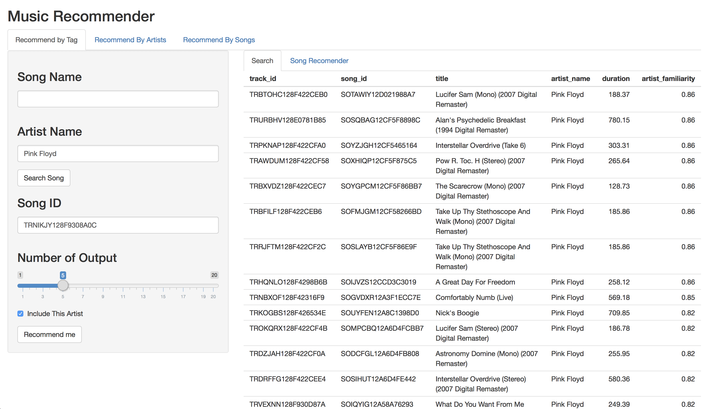

---
title: "گزارش فاز سوم پروژه تحلیل داده موسیقی"
author: "نگار مخبریان - مهدی بهروزی خواه"
output: html_document
---
<html dir="rtl"><meta charset="UTF-8" />
<font face="XB Niloofar">
```{r setup, include=FALSE}
knitr::opts_chunk$set(echo = TRUE)
```

## مقدمه
همانطور که در فاز قبلی شرح داده شد، هدف این پروژه کار با داده های موسیقی حجیم و آنالیز این داده‌ها بود. در این فاز قبلی اکثر تلاش ما سر جمع آوری و تمیز سازی داده بود که همانطور که توضیح دادیم، توانستیم داده‌های بسیار خوبی جمع آوری کنیم و تمیز کنیم و در پایگاه های داده‌اما ن قرار دهیم. چند آنالیز کلی از داده گرفتیم و سعی کردیم آمار های اولیه‌ای از داده ارائه دهیم.

در این فاز سعی کردیم به تحلیل بپردازیم و از داده‌ها استفاده کنیم. کاری که کردیم رویکرد پیشنهاد دادن آهنگ و خواننده بود و به طور کلی به چند روش مختلف recommendation system هایی را پیاده سازی کردیم که در عمل واقعا جواب‌های خوبی گرفتیم.

همچنین با استفاده از کتابخانه shiny توانستیم این قابلیت هارا interactive کنیم و به صورت یک سایت جدی، این خدمات را ارائه دهید.

## جست‌و‌جو در داده‌ها
اولین کاری که انجام دادیم، رابطی برای جست‌جوی آهنگ‌ها در داده‌ها بود، از آنجایی که همه داده‌ها را به صورت sqllite نگهداری کردیم، این قابلیت را دادیم تا افراد بر حسب نام آهنگ و یا نام خواننده، بتوانند آهنگ‌ها را پیدا کنند. 

نکته ای که هست این است که ما در این بخش دوتا ID به کاربر برای هر آهنگ میدهیم. این id ها به طور کلی فلسفه جالبی دارند. مثلا ممکن است برای یک آهنگ با یک نام، چند آهنگ هم‌نام با این آهنگ نیز وجود داشته باشند، در نتیجه باید تمایزی بین این‌ها قرار داد، همچنین ممکن است حتی یک آهنگ یک خواننده، چند بار خوانده شده باشد. اما نکته اینجاست که ما در واقع دو نوع id داریم که یکی به ازای نسخه‌های مختلف یک آهنگ، یکتاست و دیگری متفاوت و این در واقع به دلیل استفاده ما از musicbrainz id و داده‌های خوب 1 million songs است.


<div align="center">

</div>

